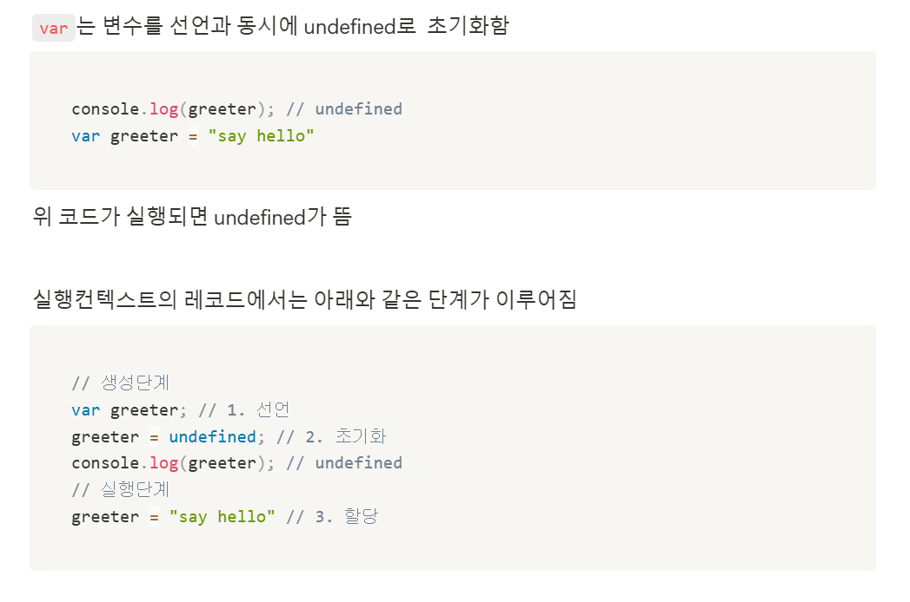

# 1조 회고

## 👨‍👩‍👧‍👦 참여 인원: 4명

### 이준열, 한수빈, 임보라, 유인철

 

## 🎙️ 발표자

### 유인철

 

## 👨‍🎤 질의 응답

### 1. 함수 표현식과 함수 선언문을 언제 사용하면 좋을지?

- 답변을 못해서 추후 알아보고 적어보기

### 2. const로 원시값을 넣으면 값을 변경할 수 없는데 객체나 배열을 넣으면 수정이 가능한 것 같은데 왜 그런지 궁금함.

- 답변 : 메모리 주소 값이라고 생각하면 쉬울 것 같음. 원시값은 메모리 주소에 값을 저장해 참조하지만 참조값 같은 경우에는 heap영역에 데이터가 저장되고 콜스택에는 heap영역의 주소값이 저장이 되기 때문에 값을 바꾸더라도 heap 영역에 데이터가 바뀌기 때문에 값 수정 가능.

 

## 💡 의견 공유

### 1. 준열님 상수 관련해서 추가 설명

### 2. 수빈님 추가 이미지

