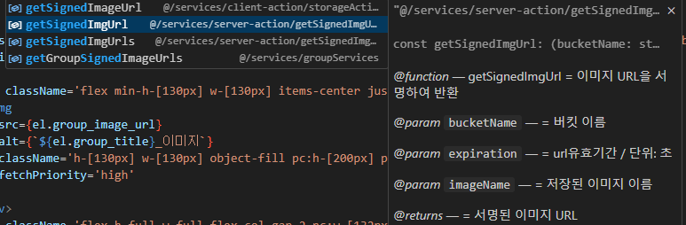

# 2조 회고

## 👨‍👩‍👧‍👦 참여 인원: 3명

### 이기성, 박준호, 전상국

 

## 🎙️ 발표자

### 이기성

 

## 👨‍🎤 질의 응답

### 1. script위치는 TTV TTI 관점에서 body 아래에 사용해야 좋은건지?

-   defer를 사용하지 않으면 그렇게 사용하는게 좋다고 생각합니다.

### 2. 호이스팅이 왜 일어나는가?

-   인터프리터가 코드를 한줄씩 읽어서 실행하는데 이떄 선언되지 않은 변수나 함수를 참조하려고하면
    오류가 발생할수있어서 런타임오류를 방지하고 코드 실행을 유연하게 하기위해
    함수선언문도 호이스팅하는 이유가 어느 위치에서든 가능하게 해서 개발 편의성을 높이려고
    이런 유연한 선언순서를 허용해서 편의를 제공했으나 let, const, 함수표현식을 사용해 TDZ로 안정성을 높이는게 좋다.

### 3. 함수 표현식과 선언문중 선언문이 더 좋다고 하셨는데 이유가 궁금합니다.

-   함수자체를 변수에 할당하기 보다는 함수선언문을 사용해서 만드는게 가독성이 더 좋다고 생각합니다.
    모던js 튜토리얼에서도 표현식보다는 선언문을 권장하고있다.

 

## 💡 의견 공유

### 1. 상국님 JSDoc 관련 공유

### 2. 준호님 함수선언/표현 관련 공유

-   선언문은 어디서나 사용가능하여 더 편리함
-   함수표현식을 외부에 선언하고 블록스코프 내부에서 할당하여 외부에서도 함수를 사용할 수 있음
